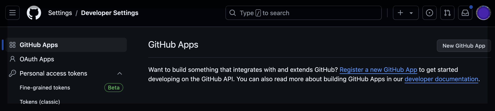
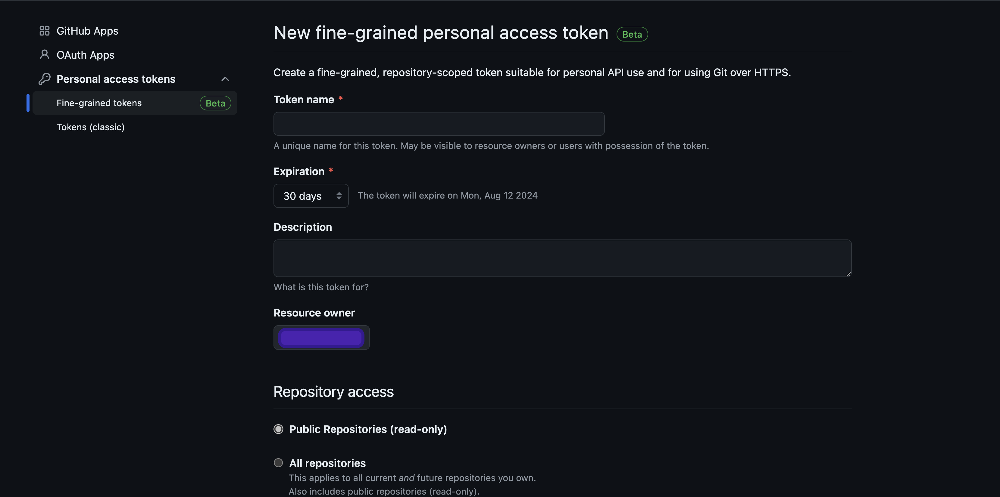

# Contributing

To run `update-reviewers` you will need to run both `update-reviews` and `update-contributors` first to create the required input `.pickle` files.

The scripts run as follows:

## update-contributors script

To run this script, you can call the following at the command line:

`update-contributors`

This script parses data from all-contributors bot `.json`
files in the following repos:

* [software-submission repo](https://github.com/pyOpenSci/software-submission) where peer review happens
* [python-package-guide repo](https://github.com/pyOpenSci/python-package-guide)
* [peer review guide repo](https://github.com/pyOpenSci/software-peer-review)
* [pyopensci.github.io (website) repo](https://github.com/pyOpenSci/pyopensci.github.io)
* [update-package-meta repo](https://github.com/pyOpenSci/update-web-metadata) *(this repo)*

Running this script:

1. Parses through all of the all-contributors bot `.json` files across our pyOpenSci repos to gather contributors to
   our organization. This allows us to [acknowledge contributors on our website](https://www.pyopensci.org/our-community/#pyopensci-community-contributors)
   who are not always making explicit code contributions (thus might not have commits). These contributors are
   reviewing guidebooks, participating in peer review, and performing other important tasks that are critical to our
   pyOpenSci mission. We acknowledge all contributions at pyOpenSci regardless of volume or size.
2. Updates the existing [contributors.yml](https://github.com/pyOpenSci/pyopensci.github.io/blob/main/_data/contributors.yml)
   file found in our website repo with new contributors and the contributor role (package guides, code workflows, peer review, etc).
   If you run the script using `--update update_all`, this script will also use the GitHub api to update the users metadata from their GitHub profile.

## update-reviews script

To run this script, you can call the following at the command line:

`update-reviews`

This script parses through our (*accepted*) review issues to find packages that have been accepted. It then grabs each
reviews editor, reviewers and package authors / maintainers. This information allows us to

1. Update a contributor's peer review metadata in the contributors.yml file in the third script.
2. Update the pyOpenSci website's package listing with the package's DOI, documentation URL.
3. Update the package's stats including stars, contributors, etc. using the GitHub API

## process_reviews.py script

To run this script, you can call the following at the command line:

`update-review-teams`

This final script is a bridge between the first it uses pickle files outputted from the
first two scripts to update each contributors peer review contributions including

1. packages submitted or reviewed
2. packages in which the contributor served as editors
3. contributor types associated with peer review including:

* peer-review
* package-maintainer
* package-reviewer
* package-editor

These general contributor types are used to drive our
[website's contributor search and filter functionality that you can see here.](https://www.pyopensci.org/our-community/index.html#pyopensci-community-contributors)

## Local setup

1. Create a local environment and activate it. If you are using conda:

```bash
mamba create -n pyos-meta python=3.10
mamba activate pyos-meta
```

2. Install the package in editable mode and associated development dependencies:

```
pip install -e ".[dev]"
```

### Setup token to authenticate with the GitHub API

To run this you need to [create a TOKEN that can be used to access the GitHub
API.](https://docs.github.com/en/rest/guides/getting-started-with-the-rest-api?apiVersion=2022-11-28#about-tokens)

In GitHub, click on your profile image and navigate to "Settings", and then
"Developer Settings".


<br/><br/>
Create a new fine-grained personal access token, adding a name, expiration,
description, and ensure the "Repository Access" is set to "Public Repositories
(read-only)". No other configuration needed. At the bottom of the page, click
"Generate token".


<br/><br/>

After obtaining a token;

1. Duplicate the `.env-default` file and rename the copy to `.env`
2. Assign your token to the `GITHUB_TOKEN` variable in the `.env` file.

## How to run each script

Each script is available through the command line through entry points specified in our `pyproject.toml` file.

## update-contributors script

To run:

`update-contributors`
`update-contributors --update update_all`

The `update-contributors` script does the following:

1. It grabs the `all-contribs.json` files from each repository and turns that json data into a dictionary of all unique
   contributors across repos. Repos include:
   * peer review guide
   * packaging guide
   * website
   * software-review
   * update-package-meta (this repo)
2. It then:

If you use the `--update update_all` flag, it will:

* Update contrib profile information including name using whatever information is available their public github
  account for website, location, organization, twitter, etc).
* Check to see that the website in their profile works, if not removes it so it doesn't begin to fail our website ci tests.

Without the `update` flag, running `update-contributors` will only add any new users that
are not already in the website `contributors.yml` file to a output `.pickle` file.

### update-reviews Returns:

* `all-contributors.pickle` file that will be used in the final update-reviewers script to update all reviewer contribution data.

## update-reviews script

To run:
`update-reviews` or
`update-reviews --update update_all`

* This script parses through all pyOpenSci issues in the [software-submissions repo](https://github.com/pyOpenSci/software-submission) issues where the issue has a label of 6/`pyOS-approved 🚀🚀🚀`.
* Grabs crucial metadata including the reviewers and editors for each.
* Adds people who have participated in peer review who are NOT listed currently in the website `contributors.yml` file

It then collects the
GitHub id and user information for:

* reviewers,
* submitting authors,
* editors and
* maintainers.

Finally, it updates GitHub statistics for
each packages including stars, last commit date and more repo metadata.

### Returns

This returns a `packages.pickle` file that will be used in the final script which bridges data between the first two scripts.

## update_reviewers script`

This script is a bridge between `update-contributors` and `update-reviews`. It parses each review in the output
`update-reviews.pickle` file and

1. updates contributor name in the review data (often the github username is there but the first and last name is missing).
   This allows us to publish the maintainer names (rather than github usernames) [on our website package listing.](https://www.pyopensci.org/python-packages.html#explore-our-accepted-scientific-python-open-source-packages)
2. Updates each review issue contributor's name in the contributor metadata. This allows us to ensure we have updated
   contributor types, package submission information etc, in the contributor.yml file on our website.

To run:
`update_reviewers`

### Returns

This final script uses the two pickle files
to update information. It then returns
two output files:

1. `_data/contributors.yml`
2. `_data/packages.yml`

Each are stored in the `/_data/file.yml` directory to mimic the directory structure of our website.

## How these scripts are used in our organization

The scripts above are called in the [GitHub
actions located here](https://github.com/pyOpenSci/pyopensci.github.io/tree/main/.github/workflows). These actions can be run manually via workflow dispatch but also have a cron job to update our metadata periodically.

### Data that these scripts update / maintain

* [website contributors.yml file](https://github.com/pyOpenSci/pyopensci.github.io/blob/main/_data/contributors.yml)
* [website packages.yml file is here](https://github.com/pyOpenSci/pyopensci.github.io/blob/main/_data/packages.yml).

## Rate limiting

TODO: right now this isn't an issue but it will be in the future I suspect....
Rate limiting - how to handle this...

## Environment setup using conda

Create environment:

`mamba env create -f environment.yml`

## pyosmeta build and release guide

Currently releases to PyPI are handled using a manual build
and push of our `sdist` and `wheel` distributions locally.

Versioning is handled using `hatch_vcs` which runs `setuptools_scm` under the hood. `hatch_vcs` uses the most current released tag in the repository
to determine what version of the package is being built.

`hatch_vcs` is setup to create `_version.py` file upon build using the most
currently released tag.

```{warning}
The `src/pyosmeta/_version.py` file should NEVER
be committed to version control. It should be ignored via our `.gitignore` file
```

If you wish to build `pyosmeta` locally to check out the .whl and source distribution (SDist):

```
# Install the package and dev dependencies
pip install -e ".[dev]"
# Build the package distribution files
hatch build
```

When you install dependencies above, `hatch` will be
installed. To see what version of the package is being
built run:

```
hatch version
```

When you run `hatch build`, it will do a few things

1. It will create a `dist` directory with the wheel and the package SDist tarball. You can see the version of `pyosmeta` in the name of those files:

```bash
dist/
   pyosmeta-0.16.dev1+g9190512.d20231220.tar.gz
   pyosmeta-0.16.dev1+g9190512.d20231220-py3-none-any.whl
```

2. `hatch build` also invokes `setuptools_scm` to create a `_version.py` file in the pyosmeta package directory:

```bash
src/
    pyosmeta/
        _version.py
```
