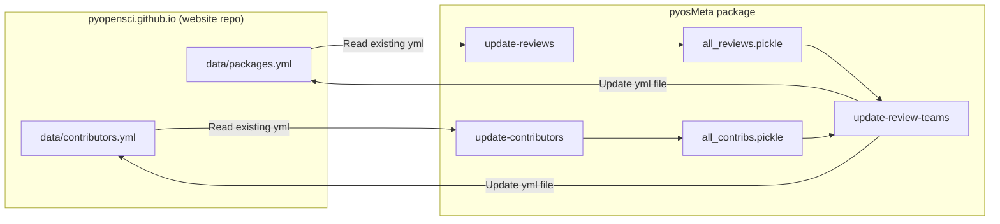

# pyosmeta

[](https://pypi.org/project/pyosmeta/)
[](https://github.com/pyopensci/update-web-metadata/blob/master/LICENSE)
[](https://doi.org/10.5281/zenodo.13159326)

<!--- Tests, Coverage, and CI badges -->
[](https://github.com/pyOpenSci/pyosMeta/actions/workflows/run-tests.yml)
[](https://codecov.io/gh/pyOpenSci/pyosMeta)
[](https://github.com/pyOpenSci/pyosMeta/actions/workflows/test-update-contribs.yml)
[](https://github.com/pyOpenSci/pyosMeta/actions/workflows/publish-pypi.yml)
[](https://github.com/pyOpenSci/pyosMeta/actions/workflows/test-run-script.yml)

## Description

**pyosmeta** provides the tools and scripts used to manage [pyOpenSci](https://pyopensci.org)'s contributor and peer
review metadata.
This repo contains several modules and several CLI scripts, including:

- `parse-history`
- `update-contributors`
- `update-reviews`
- `update-review-teams`

_Since pyOpenSci uses this tool for its website, we expect this package to have infrequent releases._

## How the metadata workflow works

The canonical YAML files live in the
[pyopensci.github.io](https://github.com/pyOpenSci/pyopensci.github.io) website
repo under `data/`:

- [`data/contributors.yml`](https://github.com/pyOpenSci/pyopensci.github.io/blob/main/data/contributors.yml)
  — community page and metrics
- [`data/packages.yml`](https://github.com/pyOpenSci/pyopensci.github.io/blob/main/data/packages.yml)
  — accepted peer-reviewed packages and GitHub metrics

A weekly (or manually dispatched) GitHub Action on the **website** repo
([`update-contribs-reviews.yml`](https://github.com/pyOpenSci/pyopensci.github.io/blob/main/.github/workflows/update-contribs-reviews.yml))
checks out that repo, installs `pyosmeta`, runs the three CLIs below in order,
then opens a PR with updates to those two files.



### What each step does

1. **`update-contributors`** — Loads the published `contributors.yml`, finds
   new people from pyOpenSci `.all-contributorsrc` files, and (with `--update`)
   refreshes profile fields from GitHub. If a person already has a `name` in
   the YAML, that value is kept and not overwritten from GitHub.
2. **`update-reviews`** — Parses accepted review issues, fetches fresh GitHub
   metrics per package, then gap-fills any missing `gh_meta` from the existing
   `packages.yml` so previously published metrics are not deleted when an API
   call fails.
3. **`update-review-teams`** — Merges the two pickle outputs (no extra API
   calls), links reviewers/editors/maintainers to packages, and writes
   `data/contributors.yml` and `data/packages.yml` relative to the current
   working directory (the website checkout in CI).

`parse-history` is a one-time helper for `date_added` values; it is not part of
the weekly pipeline.

For local setup and how to run the scripts, see the
[Development Guide](./development.md#running-the-metadata-cli-scripts).

## Installation

pyosMeta is available on PyPI and can be installed with pip:

```console
pip install pyosmeta
```

## Usage

After installing `pyosmeta`, the main entry points are:

- `update-contributors`
- `update-reviews`
- `update-review-teams`
- `parse-history` (one-time helper; not part of the weekly pipeline)

See [How the metadata workflow works](#how-the-metadata-workflow-works) for
what each weekly script does, and the
[Development Guide](./development.md#running-the-metadata-cli-scripts) for how
to run them locally.

## Contributing

- [Contributing guide](./CONTRIBUTING.md) — how to open issues and pull requests
- [Development guide](./development.md) — local setup, CLIs, tests, and releases
- [Change log](./CHANGELOG.md)

## Contributors ✨

Thanks goes to these wonderful people ([emoji key](https://allcontributors.org/docs/en/emoji-key)):

<!-- ALL-CONTRIBUTORS-LIST:START - Do not remove or modify this section -->
<!-- prettier-ignore-start -->
<!-- markdownlint-disable -->
<table>
  <tbody>
    <tr>
      <td align="center" valign="top" width="14.28%"><a href="https://github.com/xmnlab"><br /><sub><b>Ivan Ogasawara</b></sub></a><br /><a href="https://github.com/pyOpenSci/pyosMeta/commits?author=xmnlab" title="Code">💻</a> <a href="https://github.com/pyOpenSci/pyosMeta/pulls?q=is%3Apr+reviewed-by%3Axmnlab" title="Reviewed Pull Requests">👀</a> <a href="#design-xmnlab" title="Design">🎨</a></td>
      <td align="center" valign="top" width="14.28%"><a href="https://github.com/meerkatters"><br /><sub><b>Meer (Miriam) Williamson</b></sub></a><br /><a href="https://github.com/pyOpenSci/pyosMeta/commits?author=meerkatters" title="Code">💻</a> <a href="https://github.com/pyOpenSci/pyosMeta/pulls?q=is%3Apr+reviewed-by%3Ameerkatters" title="Reviewed Pull Requests">👀</a></td>
      <td align="center" valign="top" width="14.28%"><a href="https://tiffanyxiao.com/"><br /><sub><b>Tiffany Xiao</b></sub></a><br /><a href="https://github.com/pyOpenSci/pyosMeta/commits?author=tiffanyxiao" title="Code">💻</a> <a href="https://github.com/pyOpenSci/pyosMeta/pulls?q=is%3Apr+reviewed-by%3Atiffanyxiao" title="Reviewed Pull Requests">👀</a></td>
      <td align="center" valign="top" width="14.28%"><a href="https://github.com/austinlg96"><br /><sub><b>austinlg96</b></sub></a><br /><a href="https://github.com/pyOpenSci/pyosMeta/commits?author=austinlg96" title="Code">💻</a> <a href="https://github.com/pyOpenSci/pyosMeta/pulls?q=is%3Apr+reviewed-by%3Aaustinlg96" title="Reviewed Pull Requests">👀</a> <a href="#design-austinlg96" title="Design">🎨</a></td>
      <td align="center" valign="top" width="14.28%"><a href="https://github.com/paajake"><br /><sub><b>JAKE</b></sub></a><br /><a href="https://github.com/pyOpenSci/pyosMeta/pulls?q=is%3Apr+reviewed-by%3Apaajake" title="Reviewed Pull Requests">👀</a> <a href="https://github.com/pyOpenSci/pyosMeta/commits?author=paajake" title="Code">💻</a> <a href="#design-paajake" title="Design">🎨</a></td>
      <td align="center" valign="top" width="14.28%"><a href="https://luizirber.org"><br /><sub><b>Luiz Irber</b></sub></a><br /><a href="https://github.com/pyOpenSci/pyosMeta/commits?author=luizirber" title="Code">💻</a> <a href="https://github.com/pyOpenSci/pyosMeta/pulls?q=is%3Apr+reviewed-by%3Aluizirber" title="Reviewed Pull Requests">👀</a></td>
      <td align="center" valign="top" width="14.28%"><a href="https://github.com/bbulpett"><br /><sub><b>Barnabas Bulpett (He/Him)</b></sub></a><br /><a href="https://github.com/pyOpenSci/pyosMeta/commits?author=bbulpett" title="Code">💻</a> <a href="https://github.com/pyOpenSci/pyosMeta/pulls?q=is%3Apr+reviewed-by%3Abbulpett" title="Reviewed Pull Requests">👀</a></td>
    </tr>
    <tr>
      <td align="center" valign="top" width="14.28%"><a href="https://github.com/juanis2112"><br /><sub><b>Juanita Gomez</b></sub></a><br /><a href="https://github.com/pyOpenSci/pyosMeta/commits?author=juanis2112" title="Code">💻</a> <a href="https://github.com/pyOpenSci/pyosMeta/pulls?q=is%3Apr+reviewed-by%3Ajuanis2112" title="Reviewed Pull Requests">👀</a></td>
      <td align="center" valign="top" width="14.28%"><a href="https://www.sckaiser.com"><br /><sub><b>Sarah Kaiser</b></sub></a><br /><a href="https://github.com/pyOpenSci/pyosMeta/commits?author=crazy4pi314" title="Code">💻</a> <a href="https://github.com/pyOpenSci/pyosMeta/pulls?q=is%3Apr+reviewed-by%3Acrazy4pi314" title="Reviewed Pull Requests">👀</a></td>
      <td align="center" valign="top" width="14.28%"><a href="http://econpoint.com"><br /><sub><b>Sultan Orazbayev</b></sub></a><br /><a href="https://github.com/pyOpenSci/pyosMeta/commits?author=SultanOrazbayev" title="Code">💻</a> <a href="https://github.com/pyOpenSci/pyosMeta/pulls?q=is%3Apr+reviewed-by%3ASultanOrazbayev" title="Reviewed Pull Requests">👀</a></td>
      <td align="center" valign="top" width="14.28%"><a href="http://ml-gis-service.com"><br /><sub><b>Simon</b></sub></a><br /><a href="https://github.com/pyOpenSci/pyosMeta/commits?author=SimonMolinsky" title="Code">💻</a> <a href="https://github.com/pyOpenSci/pyosMeta/pulls?q=is%3Apr+reviewed-by%3ASimonMolinsky" title="Reviewed Pull Requests">👀</a></td>
      <td align="center" valign="top" width="14.28%"><a href="https://hachyderm.io/web/@willingc"><br /><sub><b>Carol Willing</b></sub></a><br /><a href="https://github.com/pyOpenSci/pyosMeta/commits?author=willingc" title="Code">💻</a> <a href="https://github.com/pyOpenSci/pyosMeta/pulls?q=is%3Apr+reviewed-by%3Awillingc" title="Reviewed Pull Requests">👀</a></td>
      <td align="center" valign="top" width="14.28%"><a href="https://ofek.dev"><br /><sub><b>Ofek Lev</b></sub></a><br /><a href="https://github.com/pyOpenSci/pyosMeta/commits?author=ofek" title="Code">💻</a> <a href="https://github.com/pyOpenSci/pyosMeta/pulls?q=is%3Apr+reviewed-by%3Aofek" title="Reviewed Pull Requests">👀</a></td>
      <td align="center" valign="top" width="14.28%"><a href="https://webknjaz.me"><br /><sub><b>Sviatoslav Sydorenko (Святослав Сидоренко)</b></sub></a><br /><a href="https://github.com/pyOpenSci/pyosMeta/commits?author=webknjaz" title="Code">💻</a> <a href="https://github.com/pyOpenSci/pyosMeta/pulls?q=is%3Apr+reviewed-by%3Awebknjaz" title="Reviewed Pull Requests">👀</a></td>
    </tr>
    <tr>
      <td align="center" valign="top" width="14.28%"><a href="https://www.linkedin.com/in/steven-silvester-90318721/"><br /><sub><b>Steven Silvester</b></sub></a><br /><a href="https://github.com/pyOpenSci/pyosMeta/commits?author=blink1073" title="Code">💻</a> <a href="https://github.com/pyOpenSci/pyosMeta/pulls?q=is%3Apr+reviewed-by%3Ablink1073" title="Reviewed Pull Requests">👀</a></td>
      <td align="center" valign="top" width="14.28%"><a href="https://www.linkedin.com/in/pllim/"><br /><sub><b>P. L. Lim</b></sub></a><br /><a href="https://github.com/pyOpenSci/pyosMeta/commits?author=pllim" title="Code">💻</a> <a href="https://github.com/pyOpenSci/pyosMeta/pulls?q=is%3Apr+reviewed-by%3Apllim" title="Reviewed Pull Requests">👀</a></td>
      <td align="center" valign="top" width="14.28%"><a href="https://www.uaw4811.org/2024-ulp-charges"><br /><sub><b>Jonny Saunders</b></sub></a><br /><a href="https://github.com/pyOpenSci/pyosMeta/commits?author=sneakers-the-rat" title="Code">💻</a> <a href="https://github.com/pyOpenSci/pyosMeta/pulls?q=is%3Apr+reviewed-by%3Asneakers-the-rat" title="Reviewed Pull Requests">👀</a></td>
      <td align="center" valign="top" width="14.28%"><a href="https://github.com/ehinman"><br /><sub><b>Elise Hinman</b></sub></a><br /><a href="https://github.com/pyOpenSci/pyosMeta/commits?author=ehinman" title="Code">💻</a> <a href="https://github.com/pyOpenSci/pyosMeta/pulls?q=is%3Apr+reviewed-by%3Aehinman" title="Reviewed Pull Requests">👀</a></td>
      <td align="center" valign="top" width="14.28%"><a href="https://github.com/hariprakash619"><br /><sub><b>Hari Prakash Vel Murugan</b></sub></a><br /><a href="https://github.com/pyOpenSci/pyosMeta/commits?author=hariprakash619" title="Documentation">📖</a></td>
      <td align="center" valign="top" width="14.28%"><a href="https://github.com/mrgah"><br /><sub><b>mrgah</b></sub></a><br /><a href="https://github.com/pyOpenSci/pyosMeta/commits?author=mrgah" title="Code">💻</a> <a href="https://github.com/pyOpenSci/pyosMeta/pulls?q=is%3Apr+reviewed-by%3Amrgah" title="Reviewed Pull Requests">👀</a></td>
      <td align="center" valign="top" width="14.28%"><a href="https://github.com/klmcadams"><br /><sub><b>Kerry McAdams</b></sub></a><br /><a href="https://github.com/pyOpenSci/pyosMeta/commits?author=klmcadams" title="Code">💻</a> <a href="https://github.com/pyOpenSci/pyosMeta/pulls?q=is%3Apr+reviewed-by%3Aklmcadams" title="Reviewed Pull Requests">👀</a></td>
    </tr>
    <tr>
      <td align="center" valign="top" width="14.28%"><a href="https://github.com/chenghlee"><br /><sub><b>Cheng H. Lee</b></sub></a><br /><a href="https://github.com/pyOpenSci/pyosMeta/pulls?q=is%3Apr+reviewed-by%3Achenghlee" title="Reviewed Pull Requests">👀</a></td>
      <td align="center" valign="top" width="14.28%"><a href="https://github.com/stevenrayhinojosa-gmail-com"><br /><sub><b>steven</b></sub></a><br /><a href="https://github.com/pyOpenSci/pyosMeta/commits?author=stevenrayhinojosa-gmail-com" title="Code">💻</a> <a href="https://github.com/pyOpenSci/pyosMeta/pulls?q=is%3Apr+reviewed-by%3Astevenrayhinojosa-gmail-com" title="Reviewed Pull Requests">👀</a></td>
      <td align="center" valign="top" width="14.28%"><a href="https://github.com/InessaPawson"><br /><sub><b>Inessa Pawson</b></sub></a><br /><a href="https://github.com/pyOpenSci/pyosMeta/pulls?q=is%3Apr+reviewed-by%3AInessaPawson" title="Reviewed Pull Requests">👀</a> <a href="https://github.com/pyOpenSci/pyosMeta/commits?author=InessaPawson" title="Code">💻</a> <a href="#infra-InessaPawson" title="Infrastructure (Hosting, Build-Tools, etc)">🚇</a> <a href="https://github.com/pyOpenSci/pyosMeta/issues?q=author%3AInessaPawson" title="Bug reports">🐛</a></td>
      <td align="center" valign="top" width="14.28%"><a href="http://anonbadger.wordpress.com/"><br /><sub><b>Toshio Kuratomi</b></sub></a><br /><a href="https://github.com/pyOpenSci/pyosMeta/commits?author=abadger" title="Code">💻</a> <a href="https://github.com/pyOpenSci/pyosMeta/pulls?q=is%3Apr+reviewed-by%3Aabadger" title="Reviewed Pull Requests">👀</a></td>
    </tr>
  </tbody>
</table>

<!-- markdownlint-restore -->
<!-- prettier-ignore-end -->

<!-- ALL-CONTRIBUTORS-LIST:END -->

This project follows the [all-contributors](https://github.com/all-contributors/all-contributors) specification.
Contributions of any kind welcome!

## Code of Conduct

Everyone interacting in the pyOpenSci project's codebases, issue trackers, chat rooms, and communication venues is
expected to follow the [pyOpenSci Code of Conduct](https://www.pyopensci.org/handbook/CODE_OF_CONDUCT.html).

## License

[MIT License](./LICENSE)
