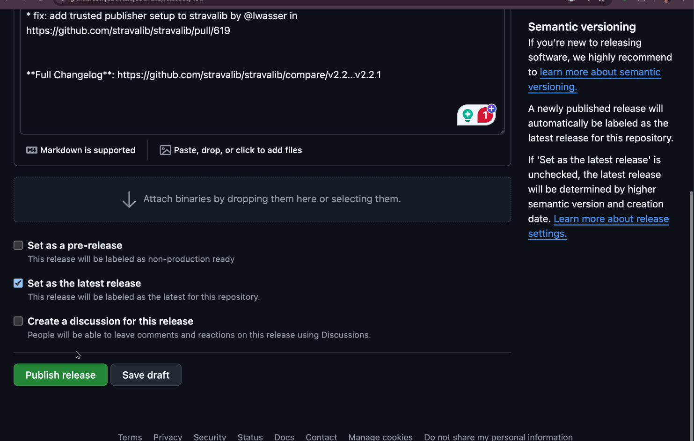

# Development Guide

If you are working on pyosMeta development, you can use Hatch to simplify the setup of a pyosMeta development environment and execute development tasks.

All of the hatch environment and script settings are defined in our project's pyproject.toml file.

## Setup a development environment

### Install hatch

1. Follow the [hatch installation instructions](https://www.pyopensci.org/python-package-guide/tutorials/get-to-know-hatch.html#install-hatch).
2. Open a new terminal and run `hatch --version` to verify that `hatch` is available.

### Open a local dev environment using hatch

In a terminal, enter:

`hatch shell`

You will now have an activated virtual environment.

[To learn more about working with Hatch environments, check out this tutorial](https://hatch.pypa.io/dev/tutorials/environment/basic-usage/)
which explains how hatch uses environments.

To deactivate an environment, enter:

`deactivate`

## Running tests

We use Hatch scripts to automate workflows. 🚀

To run tests, there is a single hatch environment that can be used with one of three
script options.

1. To run only tests with a code coverage report out in the terminal, use:

   `hatch run test:run-coverage`

2. To run tests without code coverage reports, use:
   `hatch run test:run-no-cov`

3. To run tests with an XML report generated, use:
   `hatch run test:run-report`

   The hatch run-report script is the script used in our CI test action.


When you run a hatch command, Hatch will search for an existing environment. If it doesn't exist, it will create it using the instructions provided in our pyproject.toml file. It will automatically install pyosMeta in development mode in that environment.

### Modify test scripts

You can look at this section in our
pyproject.toml file to modify how scripts are run:

```toml
[tool.hatch.envs.test.scripts]
run-coverage = "pytest --cov-config=pyproject.toml --cov=pyosmeta --cov=tests/*"
run-no-cov = "run-coverage --no-cov"
run-report = "run-coverage --cov-report=xml:coverage.xml"
```

## pyosMeta build

pyosMeta uses hatchling as its build backend.

### Build a local package

To build the package locally and create a local sdist and wheel, run:

`hatch build`

### Package versioning

We use `hatch_vcs` which uses `setuptools_scm` under the hood to track pyosMeta versions. `Hatch-vcs`
uses the most current tag in the repository to determine what version of the package is being built. This means that if you try to build the package locally and haven't fetched all tags, it could create a dated version of our package (locally)!
Under the hood, `hatch_vcs` generates a `_version_generated.py` file when it builds using the latest tag.

The `_version_generated.py` file should NEVER
be committed to version control. It should be ignored via our `.gitignore` file

When you run `hatch build`, Hatch will:

1. Create a `dist` directory with the wheel and the package sdist tarball. You can see the version of `pyosMeta` in the name of those files:

```console
dist/
   pyosmeta-1.0.0.post27-py3-non-any.whl
   pyosmeta-1.0.0.post27.tar.gz
```

2. Invoke build to call `setuptools_scm` (via Hatch-vcs) to create a `_version_generated.py` file in the pyosMeta package directory:

```console
pyosmeta/
    pyosmeta/
        _version_generated.py
```


Our release workflow is automated and can be triggered and run using the
GitHub.com interface.

We follow [semantic version](https://semver.org/) best practices for our release workflow as follows:

- MAJOR version when you make incompatible API changes
- MINOR version when you add functionality in a backward-compatible manner
- PATCH version when you make backward-compatible bug fixes

### How to make a release to PyPI

```{note}
The build workflow explained below will run on every merge to the main branch of pyosMeta to ensure that our distribution files are still valid.
```

To make a release:

- ✔️ 1. Determine with the other maintainers what release version we are moving to.
- ✔️ 2. Create a new **pull request** that does the following:

  - Organizes the `CHANGELOG.md` unreleased items into added, fixed, and changed sections
  - Lists contributors to this release using GitHub handles
  - Adds the version number of that specific release.

Below is an example of the changelog changes when
we bumped to version 1.0 of pyosMeta.

```
## Unreleased

## [v1.4] - 2024-11-22

* Fix: Parse archive and JOSS links to handle markdown links and validate DOI links are valid. Added python-doi as a dependency to ensure archive/DOI URLs fully resolve (@banesullivan)

### Added

* Add: new repos to track contribs (@lwasser)

### Fixed

* Fix: EiC field not processing correctly  (@lwasser, #234)
* Fix: Updated documentation throughout with a focus on how a user's name is accessed and updated (@lwasser)
* Fix: ReviewUser object name can be optional. There are times when we don't have the actual person's name only the GH username (@lwasser)

### Contributors to this release
@banesullivan, @lwasser

```

- ✔️ 3. Once another maintainer approves the pull request (if that is needed), you can merge it.

You are now ready to make the actual release.

- ✔️ 4. In GitHub.com go to `Releases` and prepare a new release. When you create that release you can specify the tag for this release.

Use `v` in the tag number to maintain consistency with previous releases.

This is the ONLY manual step in the release workflow. Be sure to create the correct tag number: example `v1.0.1` for a patch version.

Copy the updated changelog information into the release body or use the <kbd>Generate Release Notes</kbd> button to generate release notes automatically.

- ✔️ 5. Hit `publish release`

When you publish the release, a GitHub action will be enabled that builds the wheel and SDist.



- ✔️ 6. Authorize the deploy step of the build: The final step is to authorize the deployment to PyPI. Our build uses a GitHub environment called `PyPI` that is connected to our pyosMeta PyPI account using PyPI's trusted publisher workflow. Only our core maintenance team can authorize an action to run using this environment.


Congratulations! You've just created a pyosMeta release.
