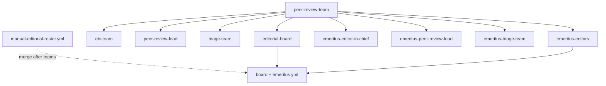
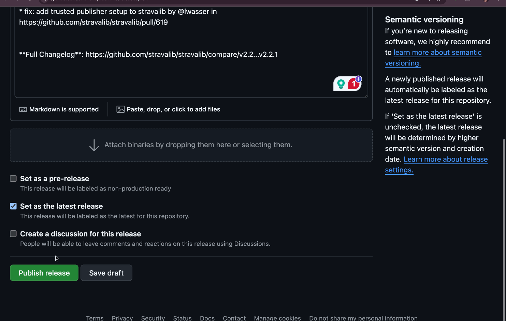

# Development Guide

To work on pyosMeta, you'll use [uv](https://docs.astral.sh/uv/) to set up the development environment and run the package's CLI scripts.

You'll use Hatch for running tests and for building/publishing releases. pyosMeta's test scripts and versioning are defined via Hatch (see [Running tests](#running-tests) and [pyosMeta build](#pyosmeta-build) below).

## Setup a development environment

### Install uv

Follow the [uv installation instructions](https://docs.astral.sh/uv/getting-started/installation/), then open a new terminal and run `uv --version` to verify it's available.

### Create the environment and install dependencies

From the repo root, run:

```console
uv sync --extra dev
```

This creates a `.venv` in the repo, installs `pyosmeta` in editable mode, and installs the `dev` dependencies (pytest, black, flake8, pre-commit, etc.) defined in `pyproject.toml`.

### Setup tokens to authenticate with the GitHub API

Most CLI scripts call the GitHub API. pyosMeta uses **two** env vars:

| Variable | Used for | Typical token |
| -------- | -------- | ------------- |
| `GITHUB_TOKEN` | Issues, contributors, package metrics (`update-reviews`, `update-contributors`, …) | Classic PAT with public-repo read access |
| `GITHUB_TOKEN_TEAMS` | Org team membership (`update-editorial-board`) | Fine-grained (or classic) token with org **Members** / team read |

1. Create a classic [personal access token](https://docs.github.com/en/authentication/keeping-your-account-and-data-secure/managing-your-personal-access-tokens) that can read public repos (for issues and contributor data).
2. Create a second token that can read pyOpenSci org teams (fine-grained with Members: Read on the org, or classic with `read:org`).
3. Duplicate `.env-default` to `.env` and set both:

```console
GITHUB_TOKEN=...
GITHUB_TOKEN_TEAMS=...
```

pyosMeta loads these from `.env` via `python-dotenv`. You do not need to export them in your shell config unless you prefer that. If you do export them:

```console
echo $SHELL
```

- zsh: add the exports to `~/.zshrc`
- bash: add them to `~/.bash_profile`

Restart the terminal (or `source` the config) after changing shell exports.

### Run the CLI scripts

Use `uv run` to execute any of the package's CLI entry points without manually activating the virtual environment:

```console
uv run update-contributors
uv run update-reviews
uv run update-review-teams
uv run update-editorial-board
uv run parse-history
uv run fetch-rss-feed
```

If you'd rather activate the virtual environment directly, run `source .venv/bin/activate`, then call the scripts directly (e.g. `update-contributors`). To deactivate, run `deactivate`.

For the weekly website pipeline overview, see the
[README](./README.md#how-the-metadata-workflow-works). Details for each script
are below.

## Running the metadata CLI scripts

`update-review-teams` expects pickle files from `update-contributors` and
`update-reviews`, so run those two first.

### update-contributors

```console
uv run update-contributors
```

With the optional `--update` flag, the script refreshes contributor profile
fields from each person's public GitHub account (website, location,
organization, Twitter, and so on). It also checks that profile websites
resolve; broken links are removed so they do not fail website CI. A name
already present in `contributors.yml` is kept and not overwritten from GitHub.
This flag is rarely needed:

```console
uv run update-contributors --update update_all
```

Without `--update`, the script only adds people who are not already in the
website's `contributors.yml`.

The script gathers contributors from `.all-contributorsrc` files across
pyOpenSci repos (so the website can acknowledge people who review guides,
participate in peer review, and help in other ways—not only those with code
commits). The repo list and contribution-type mapping live in
[`src/pyosmeta/constants.py`](./src/pyosmeta/constants.py) (`CONTRIB_REPOS` /
`REPO_CONTRIB_TYPES`). Update that file when adding or removing a tracked repo.

Running this script:

1. Parses `.all-contributorsrc` files across those repos.
2. Updates the website
   [`contributors.yml`](https://github.com/pyOpenSci/pyopensci.github.io/blob/main/data/contributors.yml)
   with new contributors and roles (via the later `update-review-teams` step).
3. With `--update update_all`, also refreshes GitHub profile metadata as
   described above.

**Returns:** `all_contribs.pickle` for `update-review-teams`.

### update-reviews

```console
uv run update-reviews
```

This script parses pyOpenSci's *accepted* review issues, then collects editors,
reviewers, authors/maintainers, and package metadata (DOI, docs URL, stars,
last commit, and related GitHub stats). That data is used to:

1. Update each contributor's peer-review metadata in `contributors.yml` (in
   `update-review-teams`).
2. Update the website package listing.
3. Refresh package stats from the GitHub API, falling back to existing
   `packages.yml` `gh_meta` when a fetch fails so published metrics are not
   deleted.

**Returns:** `all_reviews.pickle` for `update-review-teams`.

### update-review-teams

This script bridges the two pickle outputs. It does not call the GitHub API.
It updates each contributor's peer-review contributions, including:

1. Packages submitted or reviewed
2. Packages for which the contributor served as an editor
3. Contributor types used on the
   [community page](https://www.pyopensci.org/our-community/index.html#pyopensci-community-contributors):
   peer-review, package-maintainer, package-reviewer, package-editor

It also fills missing names in review data from `contributors.yml` so the
[package listing](https://www.pyopensci.org/python-packages.html) can show
people's names rather than only GitHub usernames.

```console
uv run update-review-teams
```

**Returns** (written relative to the current working directory; in CI this is
the website checkout):

1. `data/contributors.yml`
2. `data/packages.yml`

### update-editorial-board

```console
uv run update-editorial-board
```

This script builds the editor roster from GitHub org team membership and
writes three files under `data/` relative to the current working directory
(run from the website repo root):

1. `editorial-board.yml` — active editors and their role flags
2. `emeritus-editors.yml` — emeritus editors
3. `contributors.yml` — updated editorial flags (`editorial_board`,
   `emeritus_editor`) and titles

It also **reads** (never writes)
[`manual-editorial-roster.yml`](#manual-editorial-rosteryml-hand-maintained-exception)
when that file exists.

#### Source of truth: GitHub teams

Editorial membership is managed on GitHub, not by hand-editing the
generated board YAML. All editorial teams are nested under the org team
[`peer-review-team`](https://github.com/orgs/pyOpenSci/teams/peer-review-team),
which groups everyone who supports peer review (active and emeritus).

When someone is **onboarded**, add them to the appropriate active team.
When they **step down**, remove them from active teams and add them to
`emeritus-editors` plus any emeritus specialty team that matches their
former role (EiC, peer review lead, or triage). pyosMeta reads these
teams on each run of `update-editorial-board` and writes:

* `editorial-board.yml` / `emeritus-editors.yml` — role flags for the
  [peer review editorial board page](https://www.pyopensci.org/about-peer-review/index.html#our-editorial-team)
* `contributors.yml` — `editorial_board`, `emeritus_editor`, and title
  strings used on the community page and elsewhere on the site

Do **not** hand-edit `editorial-board.yml` or `emeritus-editors.yml` to
add or remove editors; change GitHub team membership instead (or use
[`manual-editorial-roster.yml`](#manual-editorial-rosteryml-hand-maintained-exception)
when they cannot be on a team).

Team slugs are defined in
[`src/pyosmeta/constants.py`](./src/pyosmeta/constants.py) (`EDITORIAL_TEAMS`):


```mermaid
flowchart TB
  PR[peer-review-team]
  PR --> EB[editorial-board]
  PR --> EIC[eic-team]
  PR --> PRL[peer-review-lead]
  PR --> TRI[triage-team]
  PR --> EE[emeritus-editors]
  PR --> EEIC[emeritus-editor-in-chief]
  PR --> EPRL[emeritus-peer-review-lead]
  PR --> ETRI[emeritus-triage-team]
  Manual[manual-editorial-roster.yml] -.->|"merge after teams"| Out[board + emeritus yml]
  EB --> Out
  EE --> Out
```

| Team slug | Role | When to use |
| --------- | ---- | ----------- |
| `editorial-board` | Active editor | Default team for current board editors |
| `eic-team` | Editor in Chief | Current EiC(s) |
| `peer-review-lead` | Peer review lead | Current peer review lead(s) |
| `triage-team` | Peer review triage | Current triage volunteers |
| `emeritus-editors` | Emeritus editor | Anyone who has stepped down from the board |
| `emeritus-editor-in-chief` | Emeritus Editor in Chief | Former EiC(s) still listed with that title |
| `emeritus-peer-review-lead` | Emeritus peer review lead | Former peer review lead(s) |
| `emeritus-triage-team` | Emeritus peer review triage | Former triage volunteer(s) |

A person can hold more than one role (for example, editor + triage, or
emeritus editor + emeritus EiC). Add them to every team that applies.

Reading these teams needs `GITHUB_TOKEN_TEAMS` (team/org read
permission). In CI that value comes from
`PYOS_READ_TEAM_MEMBERS_SECRET`.

#### `manual-editorial-roster.yml` (hand-maintained exception)

**What it is:** a small allowlist in the website repo at
`data/manual-editorial-roster.yml` for people who **cannot or will not**
be on GitHub org teams (left the org, never joined, cannot be invited).
It is the only board-related YAML you should hand-edit.

**What it is not:** Hugo does not read this file. CI never overwrites it.
It is an **input** to `update-editorial-board` only.

**How it works:** after team membership is fetched, pyosMeta merges this
file via `merge_manual_roster`. Each login is written into
`editorial-board.yml` or `emeritus-editors.yml` like a team member.
Contributor flags/titles update the same way.

**Keys (only set what is true):**

| Key | Lands in |
| --- | -------- |
| `editor: true` | `editorial-board.yml` (active editor) |
| `emeritus_editor: true` | `emeritus-editors.yml` |
| Optional: `eic`, `peer_review_lead`, `triage`, `emeritus_eic`, … | Same specialty flags as team-derived rows |

Optional `name` / `note` are for humans; the merge ignores them.

**Team membership wins.** If someone is already on a GitHub team, their
manual row is skipped.

Example:

```yaml
jbencook:
  name: Ben Cook
  note: "Not on GitHub teams"
  emeritus_editor: true

dhomeier:
  name: Derek Homeier
  note: "Not on GitHub teams"
  editor: true
```

Canonical file on the website:
[manual-editorial-roster.yml](https://github.com/pyOpenSci/pyopensci.github.io/blob/main/data/manual-editorial-roster.yml).

#### Rules and edge cases

**Active membership wins over emeritus.** The active roster is the union
of `editorial-board`, `eic-team`, `peer-review-lead`, and
`triage-team`. Anyone in an
active team is removed from the emeritus set (`emeritus_only = emeritus -
active`). So if a person is in *both* an active team and the
`emeritus-editors` team, they are treated as **active** and written to
`editorial-board.yml`, not `emeritus-editors.yml`. Example: someone on
both `peer-review-lead` and `emeritus-editors` appears only as an active
peer review lead. To make them emeritus, remove them from the active team.

**Prefer `manual-editorial-roster.yml` for people not on teams.** That
keeps them in the generated board YAML and on the editorial page. As a
safety net, anyone already flagged `emeritus_editor: true` in
`contributors.yml` but missing from teams *and* the manual file still
keeps that contributor flag (stale flags must be cleared by hand).

**Emeritus specialty flags come from GitHub teams** (or from true keys in
the manual file). ``emeritus_eic``, ``emeritus_peer_review_lead``, and
``emeritus_triage`` are set from
``emeritus-editor-in-chief``, ``emeritus-peer-review-lead``, and
``emeritus-triage-team`` membership. Add or remove people on those teams
to change their flags; existing generated YAML is not used as a fallback.

### How these scripts are used in production

They run from the website repo workflow
[`update-contribs-reviews.yml`](https://github.com/pyOpenSci/pyopensci.github.io/blob/main/.github/workflows/update-contribs-reviews.yml)
(weekly cron and manual dispatch).

Canonical data files:

* [contributors.yml](https://github.com/pyOpenSci/pyopensci.github.io/blob/main/data/contributors.yml)
* [packages.yml](https://github.com/pyOpenSci/pyopensci.github.io/blob/main/data/packages.yml)
* [manual-editorial-roster.yml](https://github.com/pyOpenSci/pyopensci.github.io/blob/main/data/manual-editorial-roster.yml)
  (hand-maintained; see above)

### Rate limiting

TODO: rate limiting is not a practical issue yet, but it likely will be.
Document how we handle GitHub API limits when that becomes necessary.

## Running tests

To run tests, you need to [install hatch](https://www.pyopensci.org/python-package-guide/tutorials/get-to-know-hatch.html#install-hatch) alongside uv.

Hatch scripts automate the test workflows. 🚀

To run tests, there is a single hatch environment that can be used with one of three
script options.

1. To run only tests with a code coverage report out in the terminal, use:

   `hatch run test:run-coverage`

2. To run tests without code coverage reports, use:
   `hatch run test:run-no-cov`

3. To run tests with an XML report generated, use:
   `hatch run test:run-report`

   The `run-report` script is the one used in the CI test action.

When you run a Hatch command, Hatch will search for an existing environment. If it doesn't exist, it will create it using the instructions provided in the `pyproject.toml` file. It will automatically install pyosMeta in development mode in that environment.

### Modify test scripts

If you need to modify or update test scripts, go to the `[tool.hatch.envs.test.scripts]` table in the `pyproject.toml` file to see the available scripts and their definitions.

```toml
[tool.hatch.envs.test.scripts]
run-coverage = "pytest --cov-config=pyproject.toml --cov=pyosmeta --cov=tests/*"
run-no-cov = "run-coverage --no-cov"
run-report = "run-coverage --cov-report=xml:coverage.xml"
```

## pyosMeta build

pyosMeta uses `hatchling` as its build backend.

### Build a local package

To build the package locally and create a local `sdist` and `wheel`, run:

`hatch build`

### Package versioning

pyosMeta uses `hatch-vcs`, which uses `setuptools_scm` under the hood to track versions. `hatch-vcs`
uses the most current git tag in the repository to determine what version of the package is being built. This means that if you try to build the package locally and haven't fetched all tags, it could create a dated version of the package (locally)!
Under the hood, `hatch-vcs` generates a `_version_generated.py` file when it builds using the latest tag.

The `_version_generated.py` file should NEVER
be committed to version control. It should be ignored via the `.gitignore` file.

When you run `hatch build`, Hatch will:

1. Create a `dist` directory with the wheel and the package `sdist` tarball. You can see the version of `pyosMeta` in the name of those files:

```console
dist/
   pyosmeta-1.0.0.post27-py3-non-any.whl
   pyosmeta-1.0.0.post27.tar.gz
```

1. Invoke build to call `setuptools_scm` (via `hatch-vcs`) to create a `_version_generated.py` file in the pyosMeta package directory:

```console
pyosmeta/
    pyosmeta/
        _version_generated.py
```

The release workflow is automated and can be triggered and run using the
GitHub.com interface.

pyosMeta's release workflow follows [semantic versioning](https://semver.org/) best practices:

- MAJOR version when you make incompatible API changes
- MINOR version when you add functionality in a backward-compatible manner
- PATCH version when you make backward-compatible bug fixes

### How to make a release to PyPI

```{note}
The build workflow explained below will run on every merge to the main branch of pyosMeta to ensure that the distribution files are still valid.
```

To make a release:

- ✔️ 1. Determine with the other maintainers what release version you are moving to.
- ✔️ 2. Create a new **pull request** that does the following:

  - Organizes the `CHANGELOG.md` unreleased items into added, fixed, and changed sections
  - Lists contributors to this release using GitHub handles
  - Adds the version number of that specific release.

Below is an example of the changelog changes made when
pyosMeta was bumped to version 1.0.

```text
## Unreleased

## [v1.4] - 2024-11-22

* Fix: Parse archive and JOSS links to handle markdown links and validate DOI links are valid. Added python-doi as a dependency to ensure archive/DOI URLs fully resolve (@banesullivan)

### Added

* Add: new repos to track contribs (@lwasser)

### Fixed

* Fix: EiC field not processing correctly  (@lwasser, #234)
* Fix: Updated documentation throughout with a focus on how a user's name is accessed and updated (@lwasser)
* Fix: ReviewUser object name can be optional. There are times when we don't have the actual person's name only the GH username (@lwasser)

### Contributors to this release
@banesullivan, @lwasser

```

- ✔️ 3. Once another maintainer approves the pull request (if that is needed), you can merge it.

You are now ready to make the actual release.

- ✔️ 4. In GitHub.com go to `Releases` and prepare a new release. When you create that release you can specify the tag for this release.

Use `v` in the tag number to maintain consistency with previous releases.

This is the ONLY manual step in the release workflow. Be sure to create the correct tag number: example `v1.0.1` for a patch version.

Copy the updated changelog information into the release body or use the <kbd>Generate Release Notes</kbd> button to generate release notes automatically.

- ✔️ 5. Hit `Publish release`

When you publish the release, a GitHub action will be enabled that builds the wheel and SDist.



- ✔️ 6. Authorize the deploy step of the build: The final step is to authorize the deployment to PyPI. pyosMeta's build uses a GitHub environment called `PyPI` that is connected to the pyosMeta PyPI account using PyPI's trusted publisher workflow. Only the core maintenance team can authorize an action to run using this environment.


Congratulations! You've just created a pyosMeta release.
